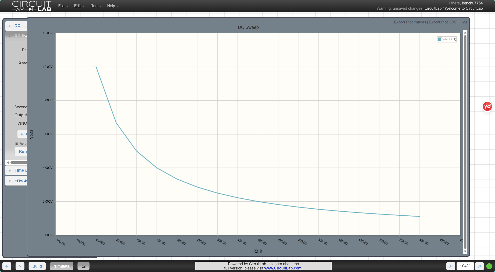
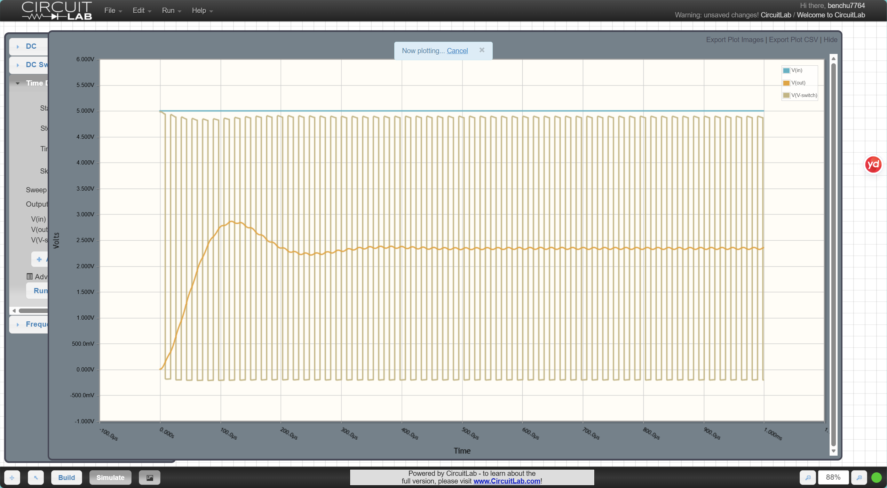
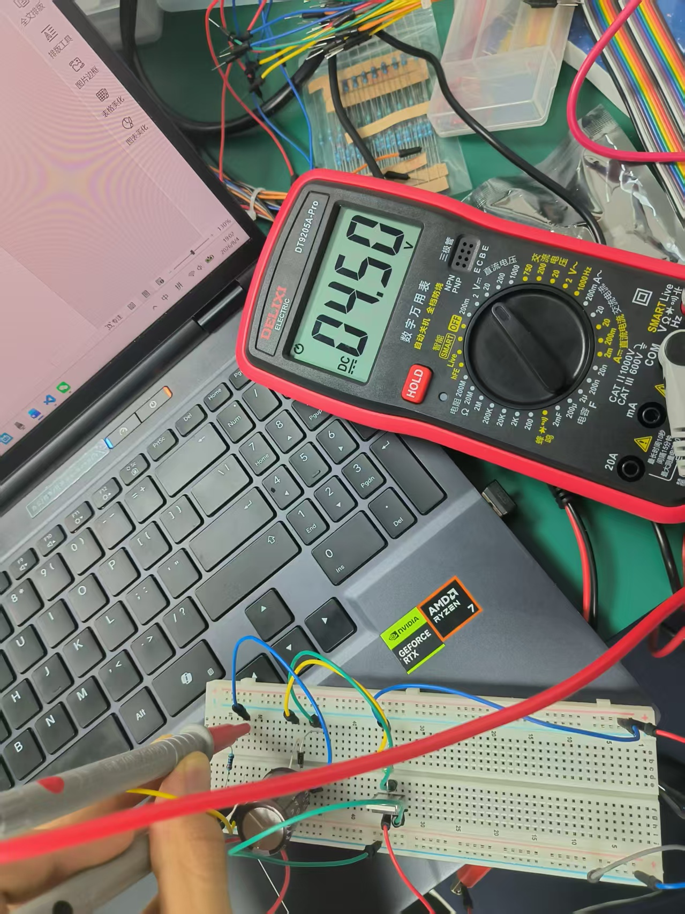

**lab1**

**R1:**

**I-total=V-total/R-total=5V/200Ω**

**set the current pass through the R1 is I2**

**100I+100I2=5**

**100X5/200+100I2=5**

**I2=5/200=I**

**so the voltage at node 1 is 5V/200ΩX100Ω=2.5V**

**R2**:

**R1:R2=100:850=2:17**

**5/19X2=V2=V-node=10/19**

**R3**:

**1.V-out=V-inXR1/(R1+R2)**

**R1/(R1+R2)=V-out/V-in=1/3**

**R1/R2=1/2**

**2.V-total=10**

**set the resistance of R1 is R**

**U1=1/3V, U2=2/3V**

**P1=U1XU1/R1<0.03W**

**R1>=1483**

**P2=U1XU1/R1<0.03W**

**R2>=370Ω**

**so R>=1483**

**R4**

**high,low**

**Real resistors and circuit boards have **small unwanted capacitors** (called parasitic capacitance). These capacitors combine with your resistors to form a  **low-pass filter** . This filter slows down fast changes (edges) of the PWM signal, causing distortion.**

******High resistance** → larger filter time constant → lower cut-off frequency → edges become slower → more distortion.****

****Low resistance** → smaller filter time constant → higher cut-off frequency → edges stay sharp → less distortion.**

**So, for high-frequency PWM, use **small resistor values** (but not too small, or they will waste too much power).**

**S1**:

**this image actually meet the expectation, because when R2=0, V-NODE1=0 and the beam is monotonically increasing, but the rate of increase gradually slows down (nonlinear) while the resistance of R2 increase**

**R5:**

**1.easy to produce**

**2.low noise**

**3.cheap in price**

**R6**:

* ****Inductor** : It  **resists changes in current** . It tries to keep the current flowing at the same level. If current tries to increase, the inductor works against it. If current tries to decrease, the inductor works to keep it going.**
* ****MOSFET** : It acts as a  **fast switch** . When the gate gets the right voltage, it turns on or off very quickly. It does not resist current changes like an inductor.**

**R7**:

****Smooths the output voltage** – The switching action creates pulses. The capacitor charges and discharges to make Vout steady.**

****Stores energy** – It stores energy when the MOSFET is on, and releases it when the MOSFET is off, keeping the output from dropping too fast.**

**R8**:

**When the MOSFET turns off, the inductor wants to keep current flowing. The diode gives it a path to do so.**

**R9**:

**The MOSFET turns on when CLK1 is  LOW .**

**explain:M1 is a **P-channel MOSFET**, it turns on when the gate voltage is **lower** than the source voltage, When CLK1 = 0V the gate is lower than source so MOSFET turns  **ON**  and when CLK1 = 5V ,the gate equals source, MOSFET turns  **OFF** .**

**R10:**

**To **ideal buck converter**, V-out = V-in × D(duty cycle)**

**V-in=5V**

****when V-out=3.3V**,3.3/5 = 0.66**

**when V-out=2V, 2/5=0.4**

**Vout is **directly proportional** to duty cycle.**

**S2:**

**R11**:

**Zooming in to 2.8V–5.0V, you will see:**

* ****A spike at around 100µs** : This is the startup transient. The inductor current builds up from zero, causing a voltage overshoot when the MOSFET turns on for the first time.**
* ****Steady output is not flat** : Because the MOSFET keeps switching, the capacitor charges and discharges, so the output has **ripple**.This is normal for switching regulators.**

**R12:**

* **When MOSFET is  **ON** : inductor current = MOSFET current, diode current = 0.**
* **When MOSFET is  **OFF** : inductor current = diode current, MOSFET current = 0.**
  **So the inductor current is continuous, but it is shared between the MOSFET and the diode alternately. This is expected for a buck converter.**

**R13**:

**When MOSFET is  **ON** : input current = inductor current, diode current = 0 (diode is reverse-biased).**

**When MOSFET is  **OFF** : inductor current flows through the diode to the output, MOSFET current = 0.**
**This is expected because the boost converter stores energy in the inductor when the switch is ON, and releases it through the diode when the switch is OFF.**

**R14:**

| Jack | USB | Power Source      | NODE1 | NODE2 | NODE3 |
| ---- | --- | ----------------- | ----- | ----- | ----- |
| 0V   | 5V  | USB               | 5V    | ~5V   | ~5V   |
| 10V  | 0V  | Jack              | 10V   | ~10V  | ~10V  |
| 10V  | 5V  | Jack (higher one) | 10V   | ~10V  | ~10V  |
| 5V   | 5V  | Both are 5V       | 5V    | ~5V   | ~5V   |

**When both Jack and USB are 5V, the simulation matches expectations. Both sources are equal, so the circuit works the same way. Small differences, if any, may come from diode drops or resistor dividers.**

**R15:**

* ****3.3V is used as the op-amp reference** : The op-amp (or comparator) uses this to check if the input voltage is above 3.3V. When USB or Jack voltage is high enough, it outputs a logic signal to switch the power path.**
* ****Why the voltage divider is needed** : It scales down a higher voltage (e.g., 10V) to a safe level (typically 0–5V or 0–3.3V) that the op-amp can handle without damage.**

**R16**:

**For 10V input, 10kHz, 50% duty cycle, ideal boost output:
**Vout=Vin/(1−D)=10/(1−0.5)=20V**V**o**u**t=**V**in/**(**1**−**D**)**=**10/**(**1**−**0.5**)**=**20**V.**
**In real circuit, due to diode drop and MOSFET loss, actual output will be **slightly lower than 20V** (around 18–19V).**

**R17:**

**Higher duty cycle gives higher output voltage. Formula: Vout=Vin/(1−D)**V**o**u**t=**V**in/**(**1**−**D**)**.**

* **D=20% , Vout = 12.5V**
* **D=35% , Vout = 15.4V**
* **D=50% , Vout = 20V**
  **Conclusion:  **Output voltage increases with duty cycle** .**

**R18:**

**With fixed input and duty cycle, increasing frequency (20kHz → 50kHz → 100kHz) causes output voltage to  **drop slightly** . Higher frequency **increases switching losses and inductor ripple current, reducing efficiency.So h**igher frequency slightly lowers output voltage due to more losses .**

**S6:**

**R19:**

**Real hardware output is usually **lower** than simulation. **

**1.Diode forward voltage drop**

**2.Diode forward voltage drop**

**R20:**

**Ideal linear regulator efficiency = Vout / Vin = 3.3 / 5.0 =  **66%** .Linear regulators drop excess voltage as heat. Larger voltage difference means more wasted power and more heat. So  **linear regulators are only used when input-to-output voltage drop is small** .**
**Linear regulators drop excess voltage as heat. Larger voltage difference means more wasted power and more heat. So  **linear regulators are only used when input-to-output voltage drop is small** .**

**R21:**

**Temp rise = Power × Thermal coefficient.**
**Allowed rise = 125 - 25 = 100°C.**
**Max power = 100 / 50 = 2W.**
**Max current = Power / Voltage drop = 2 / (5 - 3.3) = 2 / 1.7 =**1.18A** .**

**R22:**

****Quiescent current (Iq)** is the current consumed by the LDO's internal circuitry, not delivered to load.**

* **Higher Iq → more self-consumption → less current available for load, and more heat.**
* **Ideal theoretical value:  **0A** , meaning all input current goes to the load.**

**R23**:

| Fig 13 Label | Voltage (measured)   | Pin Name in Schematic | Explanation                                               |
| ------------ | -------------------- | --------------------- | --------------------------------------------------------- |
| 1            | ~5V                  | IN                    | Input voltage pin, connected to 5V                        |
| 2            | 0V                   | GND                   | Ground                                                    |
| 3            | ~3.3V                | OUT                   | Regulated 3.3V output                                     |
| 4            | ~0V or HIGH          | EN / ON               | Enable pin: HIGH turns it on, LOW turns it off            |
| 5            | ~5V or divided value | BYP / FB              | Bypass/Feedback pin for noise filtering or output setting |

**R24:**

**A buck-boost converter can step up or step down voltage. Common topology is **inverting buck-boost** or  **4-switch buck-boost** :**

****Buck mode** : duty cycle < 0.5, output lower than input.*

*****Boost mode** : duty cycle > 0.5, output higher than input.**
Principle: By controlling the MOSFET ON-time (duty cycle), the inductor stores and releases energy in different ratios, setting the output voltage.*

**R25:**
