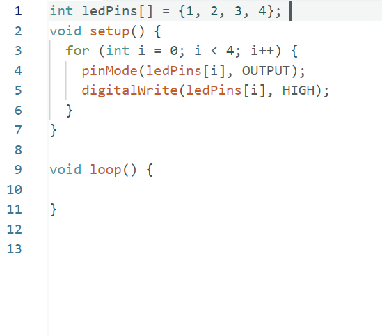
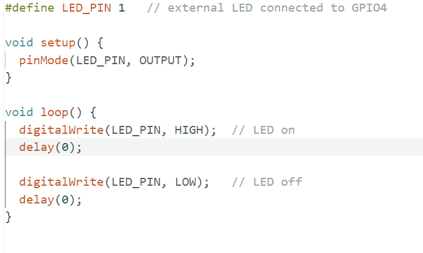
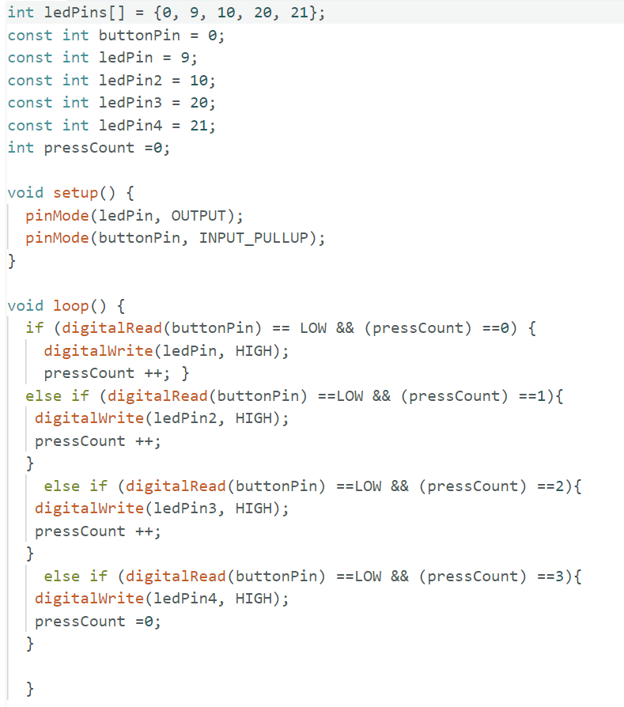
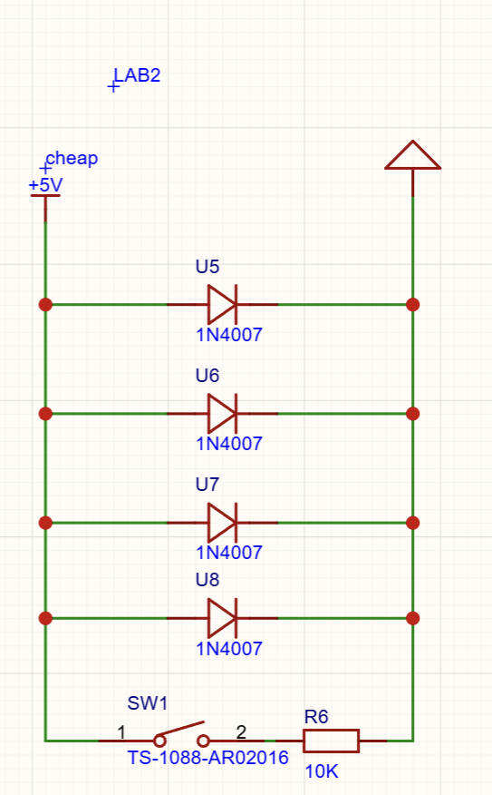
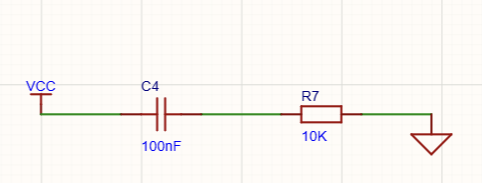
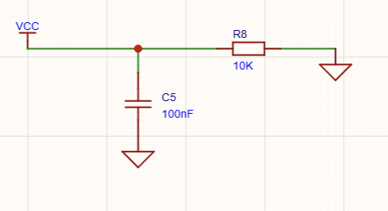
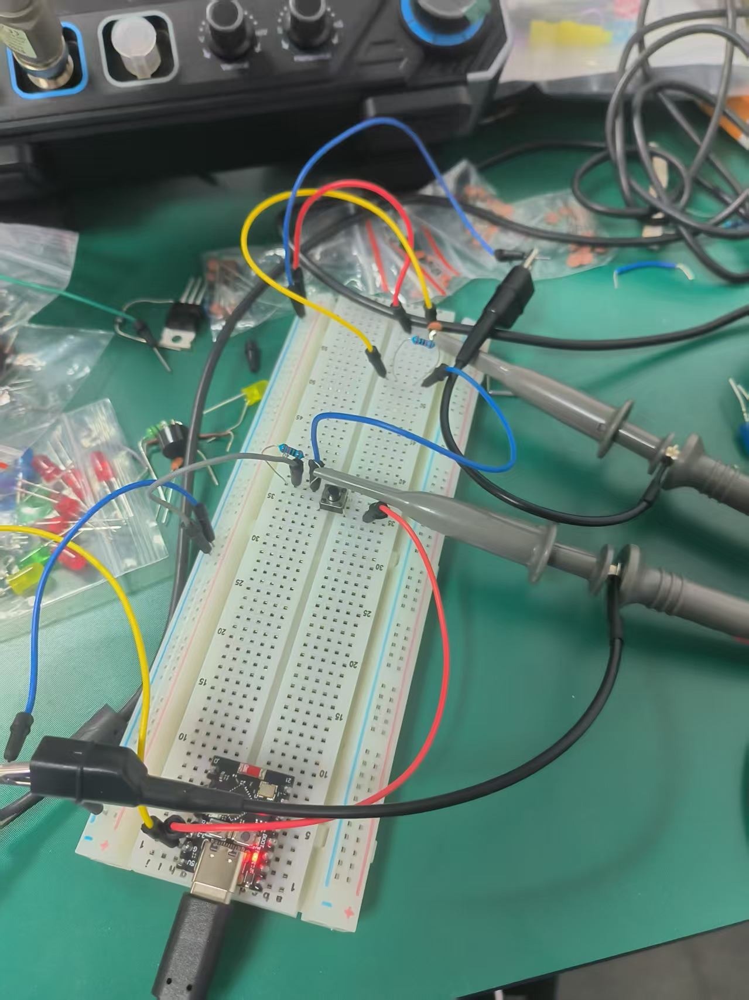
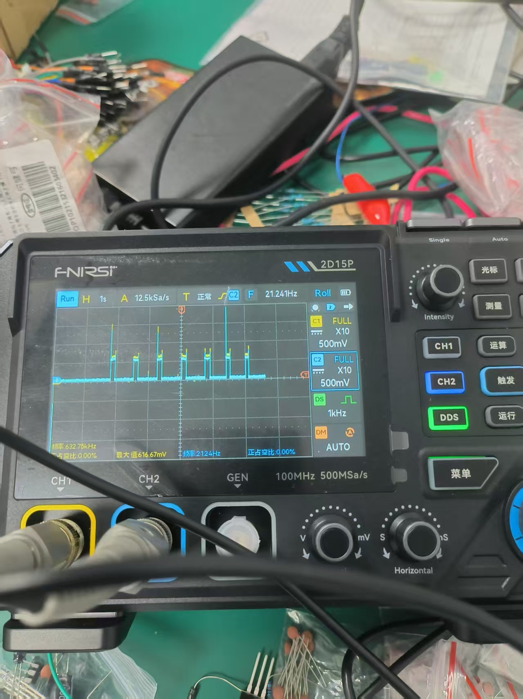
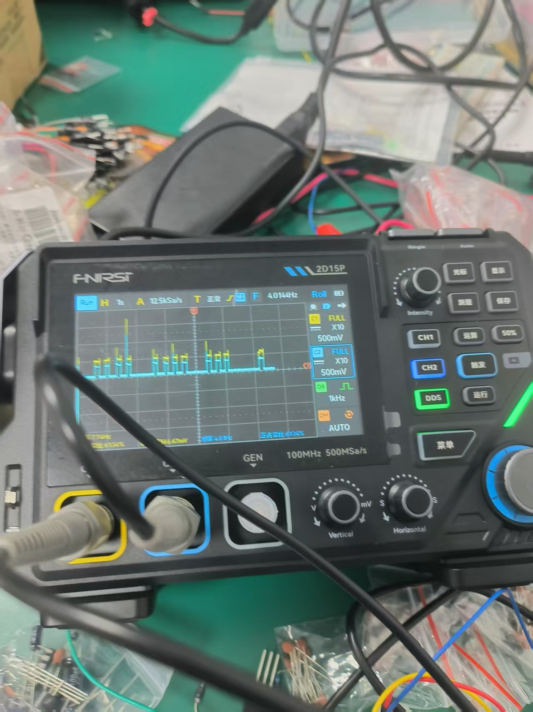

# Lab 2 Report

---

## Part A: Button Interrupt Experiment

### Setup / Schematics

**S1:**



**S2:**



**S3:**



**S4:**



### Code

**C1 — Button Interrupt Implementation:**

```cpp
#define BUTTON_PIN   PB0
#define LED_PIN      PB5
volatile bool buttonPressed = false;

void setup() {
  DDRB |= (1 << LED_PIN);
  DDRB &= ~(1 << BUTTON_PIN);
  TCCR1B = 0; // 先清零
  TIMSK1 |= (1 << ICIE1);
  TCCR1B |= (1 << CS10);     // 时钟源 = 系统时钟（无分频）
  TCCR1B &= ~(1 << ICES1);
  sei();
  PORTB &= ~(1 << LED_PIN);
}

ISR(TIMER1_CAPT_vect) {
  TIFR1 |= (1 << ICF1);
  if (PINB & (1 << BUTTON_PIN)) {
    PORTB &= ~(1 << LED_PIN);
    buttonPressed = false;
    TCCR1B &= ~(1 << ICES1);
  }
  else {
    PORTB |= (1 << LED_PIN);
    buttonPressed = true;
    TCCR1B |= (1 << ICES1);
  }
}

void loop() {
}
```

### Analysis

**R2 — Interrupts vs. Polling:**

#### Advantage of Interrupts over Polling

**More efficient use of the CPU.**

With polling, the microcontroller constantly checks the button state in a loop, even when nothing happens. This wastes processing time and prevents the CPU from doing other useful work.

With interrupts, the CPU is free to run other tasks. It only pauses briefly when the button is pressed or released. After handling the button event (which takes only a few microseconds), it immediately returns to the main work. This is like having a doorbell instead of constantly checking the door.

---

#### Disadvantage of Interrupts over Polling

**More complex code and harder debugging.**

Polling code runs step by step in order. If something goes wrong, it is easy to trace the problem because you can follow the flow of the program.

Interrupt code runs asynchronously — it can fire at any time, interrupting the main program. This makes it harder to understand and debug. You need to learn low-level register settings (like `TCCR1B` and `TIMSK1`) instead of simple functions like `pinMode()` and `digitalWrite()`. Also, you cannot use `delay()` inside an interrupt routine, and you must keep the interrupt handler very short, or it will slow down the whole system.

---

**R3 — Timing Calculations:**

- 0.05 × 16,000,000 = **800,000 t**
- 0.02 × 16,000,000 = **320,000 t**
- 0.4 × 16,000,000 = **6,400,000 t**

**R4 — Prescaler:**

The prescaler lets the counter count more slowly, so it takes longer to reach its maximum value. This allows the microcontroller to measure **longer time intervals** without the counter overflowing.

**R5 — Filters:**

High-pass filter:



Low-pass filter:



---

## Part B: Morse Code Experiment

### Setup Images

**I1:**



**I2:**



**I3:**



### Analysis

**R6 — Hardware Debouncing Capacitor Selection:**

A **10 nF capacitor** is more desirable for hardware debouncing.

**Reasoning:**

Based on the oscilloscope waveforms and the RC circuit behavior, hardware debouncing works by using the charging/discharging characteristics of an RC circuit to absorb the high-frequency pulses caused by mechanical contact bounce. When you press or release a button, the mechanical contacts do not settle immediately. Instead, they bounce rapidly (within microseconds to milliseconds), causing the voltage signal to fluctuate wildly. The capacitor acts like a "reservoir" that absorbs these spikes and smooths out the voltage transitions.

- **With a 1 nF capacitor:** From the RC time constant formula (τ = R × C), a smaller capacitance means a very short charge/discharge time constant. This means it cannot fully filter out the short, high-frequency bounce signals that occur when the button is pressed. When you zoom in on the oscilloscope, you will likely see visible spikes or jagged edges on the voltage waveform right at the moment the button is pressed. The transition is not clean.

- **With a 10 nF capacitor:** Increasing the capacitance by 10 times makes the RC time constant proportionally larger. This slows down the voltage change, effectively smoothing out the bounce waveform that lasts for tens to hundreds of microseconds. On the oscilloscope, you will see a much cleaner, smoother rising or falling edge without excessive "glitches." This larger capacitance ensures that the voltage does not jump wildly before the button settles, allowing the microcontroller to read a stable and reliable logic level.

---

### Decoder Code

**C2 — Morse Code Decoder:**

```cpp
#define BTN_PIN    2
#define DOT_LED    9
#define DASH_LED   10
#define T          100
#define DOT_MIN    T/2  // 50ms
#define DOT_MAX    2*T  // 200ms
#define DASH_MIN   2*T  // 200ms
#define DASH_MAX   4*T  // 400ms
#define SPACE_MIN  4*T  // 400ms

const char* morseMap[] = {
  ".-",   // A
  "-...", // B
  "-.-.", // C
  "-..",  // D
  ".",    // E
  "..-.", // F
  "--.",  // G
  "....", // H
  "..",   // I
  ".---", // J
  "-.-",  // K
  ".-..", // L
  "--",   // M
  "-.",   // N
  "---",  // O
  ".--.", // P
  "--.-", // Q
  ".-.",  // R
  "...",  // S
  "-",    // T
  "..-",  // U
  "...-", // V
  ".--",  // W
  "-..-", // X
  "-.--", // Y
  "--.."  // Z
};

String currentCode = "";
bool lastButtonState = HIGH;
unsigned long pressTime = 0;
unsigned long releaseTime = 0;

void setup() {
  Serial.begin(9600);
  pinMode(BTN_PIN, INPUT_PULLUP);
  pinMode(DOT_LED, OUTPUT);
  pinMode(DASH_LED, OUTPUT);
  digitalWrite(DOT_LED, LOW);
  digitalWrite(DASH_LED, LOW);

  Serial.println("=== Morse Code Decoder ===");
  Serial.println("Press button: dot (short) or dash (long)");
  Serial.println("Release >400ms = space (end of character)");
  Serial.println("-----------------------------");
}

void loop() {
  bool currentState = digitalRead(BTN_PIN);

  while (currentState == LOW && lastButtonState == HIGH) {
    pressTime = millis();
    lastButtonState = LOW;
    currentState = digitalRead(BTN_PIN);
  }

  while (currentState == HIGH && lastButtonState == LOW) {
    releaseTime = millis();
    unsigned long duration = releaseTime - pressTime;
    lastButtonState = HIGH;

    if (duration >= DOT_MIN && duration <= DOT_MAX) {
      currentCode += ".";
      Serial.print(".");
      flashLED(DOT_LED);
    }
    else if (duration >= DASH_MIN && duration <= DASH_MAX) {
      currentCode += "-";
      Serial.print("-");
      flashLED(DASH_LED);
    }

    currentState = digitalRead(BTN_PIN);
  }

  while (lastButtonState == HIGH && millis() - releaseTime > SPACE_MIN && currentCode.length() > 0) {
    char decoded = decodeMorse(currentCode);
    if (decoded != '?') {
      Serial.print(" -> ");
      Serial.print(decoded);
      Serial.print(" (ASCII: ");
      Serial.print((int)decoded);
      Serial.println(")");
    } else {
      Serial.println(" -> [?] (Unknown code)");
    }

    currentCode = "";
    releaseTime = millis();
  }

  delay(10);
}

char decodeMorse(String code) {
  for (int i = 0; i < 26; i++) {
    if (code == morseMap[i]) {
      return 'A' + i;
    }
  }
  return '?';
}

void flashLED(int ledPin) {
  digitalWrite(ledPin, HIGH);
  delay(50);
  digitalWrite(ledPin, LOW);
}
```

### Decoder Demo

**V1:**


---

### Encoder Code

**C3 — Morse Code Encoder:**

```cpp
#define LED_PIN    9
#define DOT_LED    10
#define DASH_LED   11

#define T          200
#define DOT_DUR    T
#define DASH_DUR   3*T
#define SYM_GAP    T
#define CHAR_GAP   3*T
#define WORD_GAP   7*T

const char* morseMap[] = {
  // A-Z
  ".-",    // A
  "-...",  // B
  "-.-.",  // C
  "-..",   // D
  ".",     // E
  "..-.",  // F
  "--.",   // G
  "....",  // H
  "..",    // I
  ".---",  // J
  "-.-",   // K
  ".-..",  // L
  "--",    // M
  "-.",    // N
  "---",   // O
  ".--.",  // P
  "--.-",  // Q
  ".-.",   // R
  "...",   // S
  "-",     // T
  "..-",   // U
  "...-",  // V
  ".--",   // W
  "-..-",  // X
  "-.--",  // Y
  "--..",  // Z
  // 0-9
  "-----", // 0
  ".----", // 1
  "..---", // 2
  "...--", // 3
  "....-", // 4
  ".....", // 5
  "-....", // 6
  "--...", // 7
  "---..", // 8
  "----.", // 9

  " "
};

String getMorse(char c) {
  if (c >= 'A' && c <= 'Z') return morseMap[c - 'A'];
  if (c >= 'a' && c <= 'z') return morseMap[c - 'a'];
  if (c >= '0' && c <= '9') return morseMap[26 + (c - '0')];
  if (c == ' ') return " ";
  return "";
}

void ledOn() {
  digitalWrite(LED_PIN, HIGH);
}

void ledOff() {
  digitalWrite(LED_PIN, LOW);
}

void sendDot() {
  ledOn();
  delay(DOT_DUR);
  ledOff();
  delay(SYM_GAP);
}

void sendDash() {
  ledOn();
  delay(DASH_DUR);
  ledOff();
  delay(SYM_GAP);
}

void sendMorseChar(String code) {
  for (int i = 0; i < code.length(); i++) {
    if (code[i] == '.') {
      sendDot();
    } else if (code[i] == '-') {
      sendDash();
    }
  }

  delay(CHAR_GAP - SYM_GAP);
}

void sendMessage(String message) {
  Serial.print("Sending: ");
  Serial.println(message);

  for (int i = 0; i < message.length(); i++) {
    char c = message[i];
    String code = getMorse(c);

    if (code == " ") {
      delay(WORD_GAP);
      Serial.print("  ");
    } else if (code.length() > 0) {
      Serial.print(code);
      Serial.print(" ");
      sendMorseChar(code);
    }
  }

  Serial.println();
  Serial.println("Message sent!");
  Serial.println("------------------------");
}

void setup() {
  Serial.begin(9600);

  pinMode(LED_PIN, OUTPUT);
  pinMode(DOT_LED, OUTPUT);
  pinMode(DASH_LED, OUTPUT);

  digitalWrite(LED_PIN, LOW);
  digitalWrite(DOT_LED, LOW);
  digitalWrite(DASH_LED, LOW);

  Serial.println("==========================================");
  Serial.println("    Morse Code Encoder - Part F");
  Serial.println("==========================================");
  Serial.println("LED will flash the following message:");
  String message = "HELLO WORLD ESE5190";
  Serial.print("Message: ");
  Serial.println(message);
  Serial.println("------------------------------------------");
  Serial.println("Sending in 3 seconds...");
  delay(3000);
  sendMessage(message);

  Serial.println("Press RESET to send again, or change the message in code.");
}

void loop() {
  static unsigned long lastBlink = 0;
  static bool state = false;

  if (millis() - lastBlink > 2000) {
    state = !state;
    digitalWrite(LED_PIN, state);
    lastBlink = millis();
  }
}
```

### Encoder Demo

**V2:**

