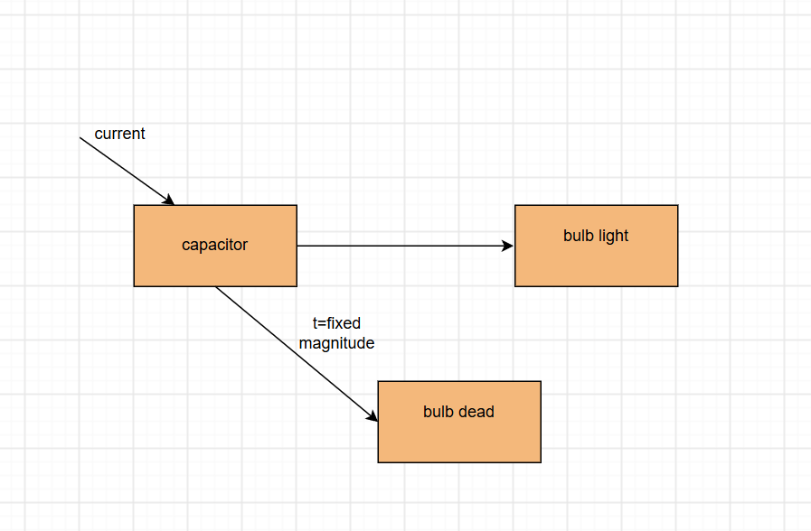
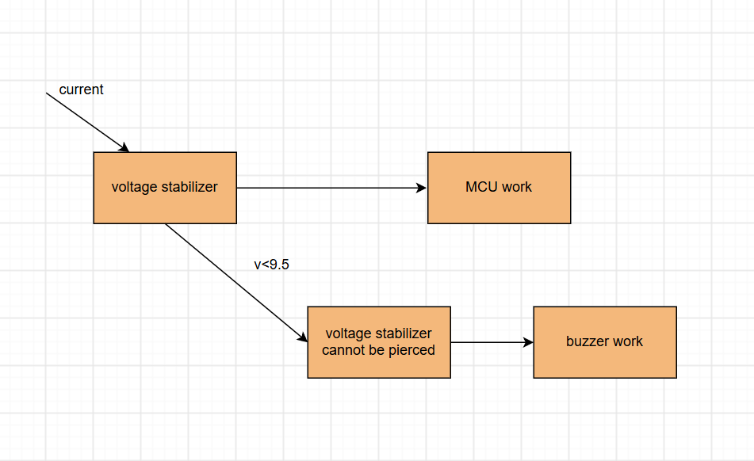
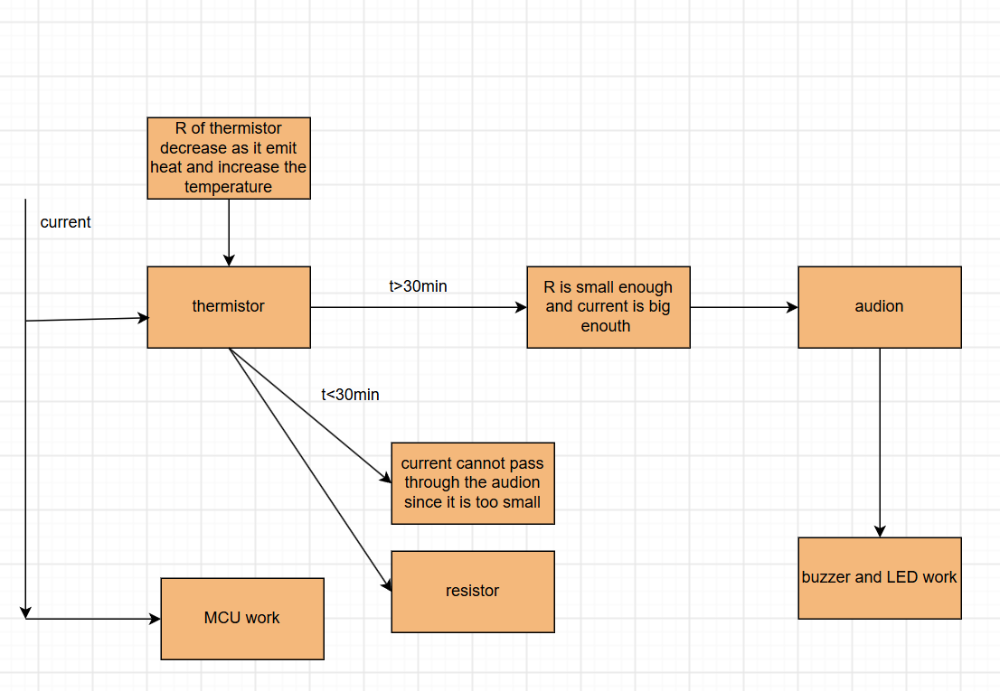
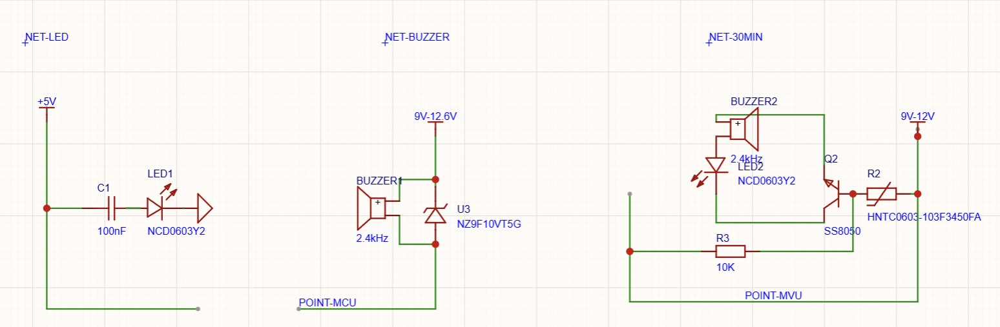
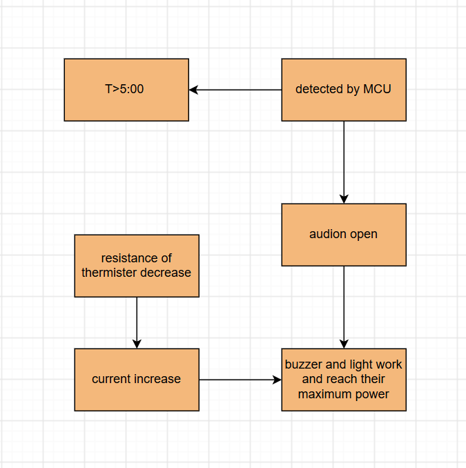
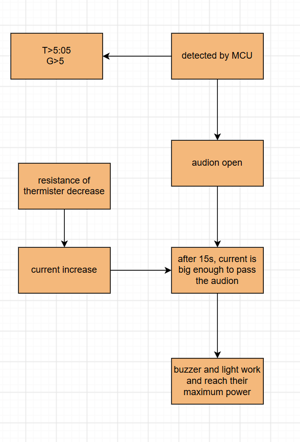
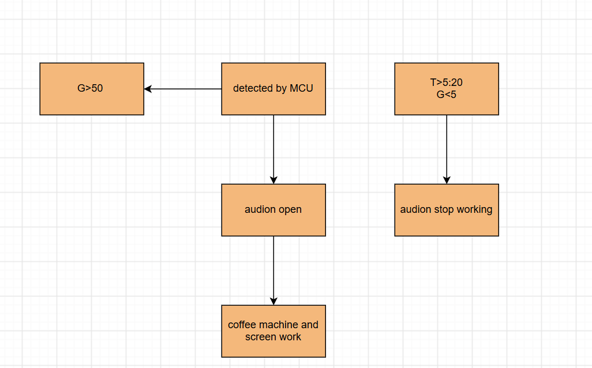
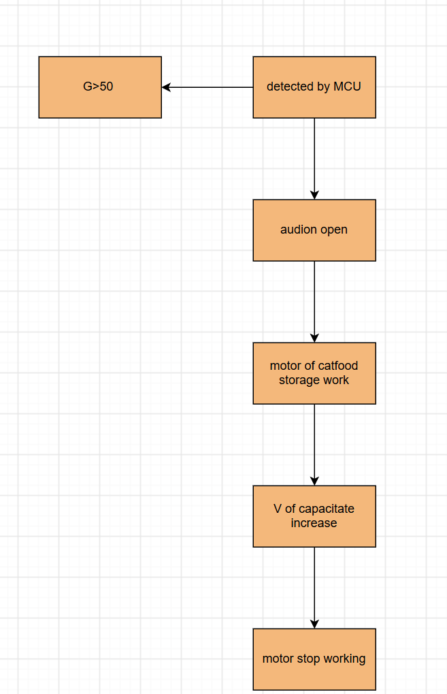
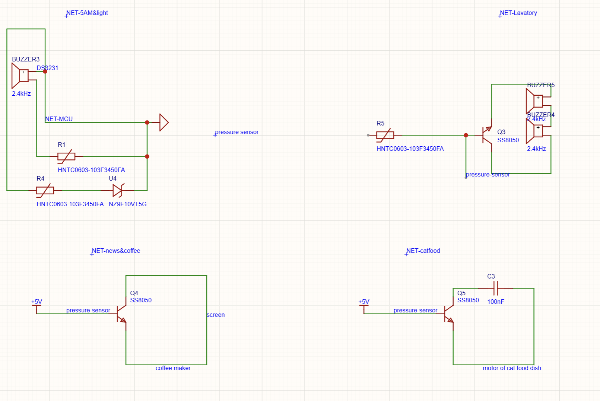
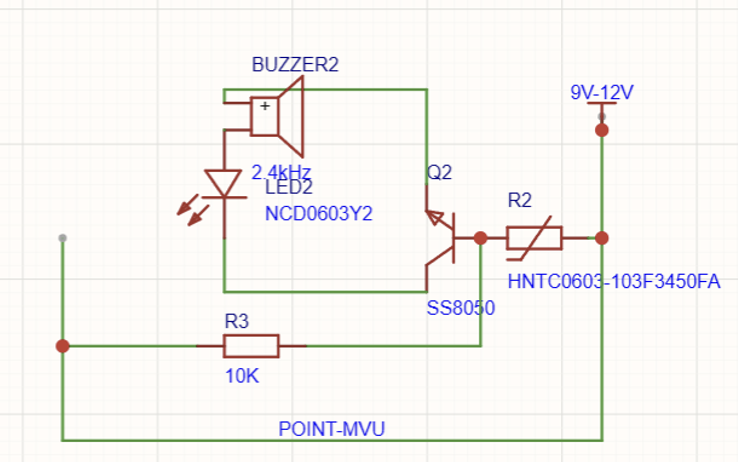

## R1 & R2

### Event 1 – Peripheral plugged in → turn on nearby LED

- **Detection:** A signal pin on the connector changes state (high or low) when something is plugged in.
- **Action:** This signal directly drives the LED with +5V. No MCU is needed.

### Event 2 – Battery voltage below 9.5V → buzzer sounds

- **Detection:** A voltage monitor chip (U3) checks the battery level. It triggers when the voltage drops below 9.5V.
- **Action:** The chip's output turns on the buzzer directly.

### Event 3 – System on for over 30 minutes → LED flashes fast + buzzer rings until button is pressed

- **Detection:** An NTC thermistor (R2) heats up over time from current flow. Its resistance drops as it gets hotter. After about 30 minutes, the voltage at the transistor base becomes high enough to turn on Q2.
- **Action:** Q2 turns on, which powers both the flashing LED and the buzzer. Pressing a button cuts off the circuit and stops the alarm.

## S1

### For event 1

### For event 2

### For event 3

### Image of circuit

## R4

### Event 1 – 5:00 AM alarm + light gradual start

MCU reads the DS3231 RTC. When the time parameter reaches 5:00 AM, MCU connects the audio circuit and the light circuit. MCU uses PWM to control the buzzer volume from low to high within 15 seconds, and controls the light brightness from dim to bright within 10 seconds.

---

### Event 2 – No one enters bathroom within 5 minutes → loud alarm

MCU continues reading the RTC and the pressure sensor. If the time is later than 5:05 AM and the pressure sensor has no reading, MCU drives the buzzer at maximum volume. There will be 2 buzzers in the circuit behind the audio driver for a louder, annoying sound. The buzzer will keep ringing until the pressure sensor detects a reading.

When the pressure sensor has a reading more than 30kg, MCU takes the opposite action – it stops the annoying alarm.

---

### Event 3 – Someone enters bathroom → coffee maker + screen + cat food

When the RTC reading is later than 5:00 AM and the pressure sensor has a reading more than 30kg, MCU triggers the audio circuit. It also turns on the screen (to show weather and news) and the coffee maker.

These actions will terminate when the pressure sensor has a reading less than 5kg (meaning the person has left) and the RTC reading is later than 5:20 AM.

---

### Event 4 – Cat food dispenser

When the pressure sensor has a reading more than 30kg, MCU connects the circuit to make the motor of the cat food storage door open. The motor runs for 5 seconds to dispense food into the bowl.

When the pressure sensor has a reading less than 5kg (person left the bathroom), MCU closes the cat food storage door.

## R5

### 1. DS3231 RTC (Sensor → MCU)

- **Raw data:** The RTC stores time data as binary or BCD values (seconds, minutes, hours, days, months, years) in its internal registers.
- **Firmware processing:** MCU reads these registers through I²C communication. It converts BCD to decimal numbers, then compares the current time with the set thresholds (5:00 AM, 5:05 AM, 5:20 AM).
- **MCU output action:** Based on the comparison results, MCU decides whether to start the alarm, start the gradual light, or stop certain functions.

### 2. HX711 + 50kg Load Cell (Sensor → MCU)

- **Raw data:** The HX711 is a 24-bit ADC chip designed for bridge sensors. The load cell (50kg capacity) outputs a differential analog voltage (in millivolts) when weight is applied. The HX711 amplifies this signal and converts it to a 24-bit digital value.
- **Communication:** HX711 communicates with MCU using two pins: SCK (clock) and DOUT (data). MCU sends clock pulses to read the 24-bit data serially.
- **Firmware processing:** MCU reads the 24-bit raw value from HX711. It then subtracts the tare value (reading with no weight) to get the net value. Using a calibration factor (obtained by placing a known weight on the sensor), MCU converts the net value to actual weight in kg.
- **Useful information:** Weight value in kg. MCU compares it with thresholds: >30kg means someone is standing on it; <5kg means the person has left; 0kg means no one is there.
- **MCU output action:** If weight > 30kg: stop alarm, start coffee maker, turn on screen, open cat food dispenser for 5 seconds. If weight < 5kg: close cat food dispenser, stop coffee maker and screen (after 5:20 AM).

## S2

### For event 1

### For event 2

### For event 3

### For event 4

### Circuit

## R7

High impedance means the pin is electrically disconnected from the circuit. It acts like it is not there. It does not drive the signal high or low. Instead, it lets another device control the voltage on that line. This state is also called "floating" or "tri-stated."

## R8

- **A pin change interrupt detects a change in the logic level on a pin (from low to high, or high to low) and runs a small piece of code immediately when that change happens.**
- **Input capture is a timer feature. It records the exact value of a timer counter when a change happens on a pin. It does not run code right away; instead, it saves the time of the event so the software can read it later.**

## R9

- **Use a pin change interrupt when you need to respond quickly to an external event, like a button press or a sensor going active.**
- **Use input capture when you need to measure the exact time of an event, such as the length of a pulse or the time between two edges. For example, measuring the speed of a motor or the distance from an ultrasonic sensor.**

## R10

- **In PWM mode, the timer automatically creates a square wave with a fixed frequency and a duty cycle that you can control. The hardware handles the timing, so it is stable and uses almost no CPU time.**
- **In non-PWM modes (like normal or CTC mode), the timer just counts up and resets. To create a PWM-like signal, you have to change the pin state manually in software. This uses more CPU time and is less precise.**

## R11

1. **Successive Approximation** – This method compares the input voltage with a series of reference voltages. It starts with the most significant bit and works down to the least significant bit, getting closer to the input value with each step. It is fast and widely used.
2. **Delta-Sigma (or Sigma-Delta)** – This method uses a very high sampling rate and compares the input with a reference. It produces a stream of 1-bit values and then uses digital filtering to get a high-resolution result. It is good for high precision but slower.

## R12

Resolution tells you how many different digital values the ADC can produce. Higher resolution means smaller steps between values, so you can measure smaller changes in voltage. This gives more accurate and detailed readings. Lower resolution means larger steps and less detail.

## R13

Four uses for ADC:

1. Reading a temperature sensor.
2. Measuring battery voltage.
3. Reading a potentiometer (like a volume knob).
4. Converting sound from a microphone into digital data.

The ATmega328PB uses the Successive Approximation method.

## S3

because there are no thermister in circuit lab, so i can't put share link in here

## R14

- LED (1)
- C1 (1)
- BUZZER1 (1)
- U3 (1)
- BUZZER2 (1)
- Q2 (1)
- R2 (1)
- R3 (1)

Total = 8 components.

## R15

**Why a company might use it:**

It is extremely low-cost (only 8 components), uses standard SMD parts, and provides simple buzzer/LED alert functionality controlled by a microcontroller GPIO. It is suitable for basic timers or alarms where a single monotone beep is sufficient.

**Why a company might avoid it:**

The circuit lacks current limiting for the LED, has no volume control or EMC filtering for the buzzer, and offers no fail-safe protection—if Q2 shorts, the buzzer stays on indefinitely. It also has no self-diagnostic capability to confirm the buzzer is working.

**Product type matters significantly:**

- **Children’s toy** — Possibly, but modifications are needed (add LED resistor, volume limit, and ensure no exposed high voltage). Safety standards require durability and hearing protection, which this circuit does not inherently meet.
- **Medical device** — Absolutely not. Medical alarms require redundant alerting, variable tones for different urgency levels, self-test on startup, and high reliability per IEC 60601. This single-transistor design has no diagnostics and could fail silently.
- **Wearable device** — Unlikely. The 9–12.6V supply is incompatible with typical 3.7V batteries (would need a boost converter), the buzzer draws too much current for small batteries, and wearables generally prefer vibration alerts over audible buzzers for discretion.

**Bottom line:** This is a generic, low-cost beeper driver acceptable for **non-critical consumer gadgets** (e.g., kitchen timers, doorbells). For toys, use with caution and add protection; for medical or wearable devices, it is **not suitable** due to safety, power, and reliability concerns.

## extra matters

## BOM附件

[WS1 - Power - Sample BOM.xlsx](./WS1%20-%20Power%20-%20Sample%20BOM.xlsx) — 点击下载/查看物料清单（BOM）
