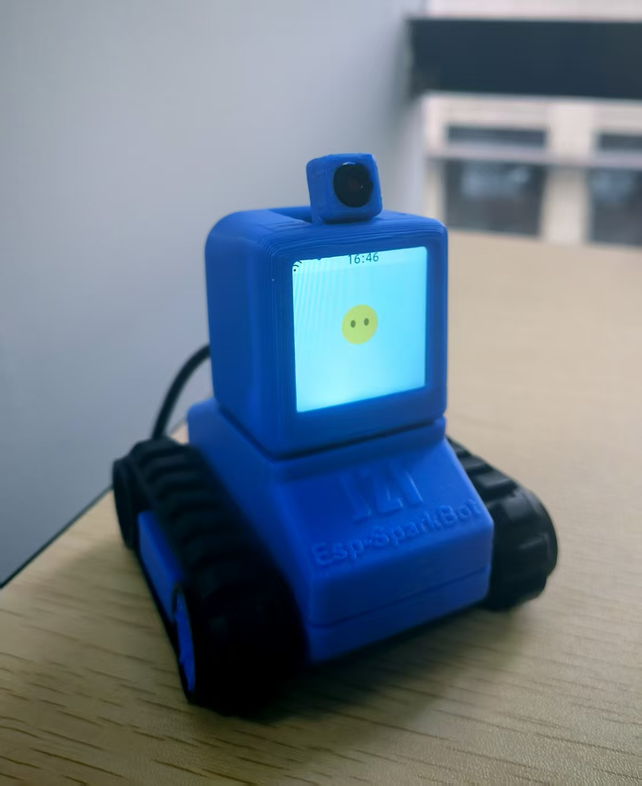
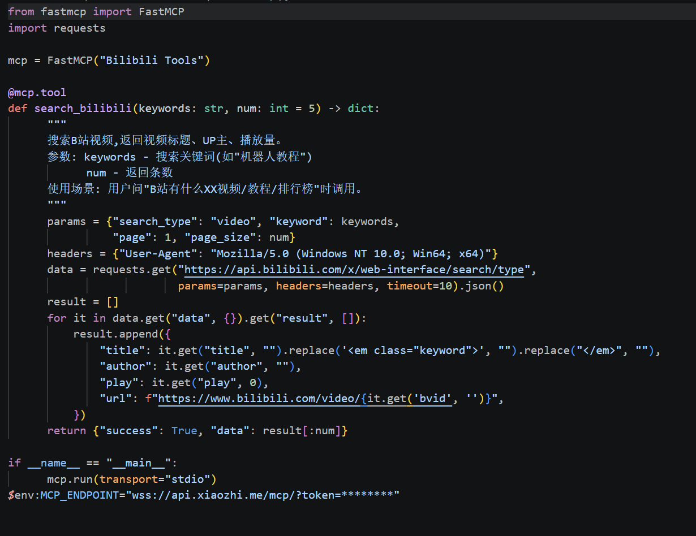

# ******LTL's desk satellite******

————————————————————————————————————————————————————————————————————

    done by LTL

### **Main Hardware Parts :**

The core hardware of this desk satellite robot is based on the "EspSparkBot" model from Espressif's ESP32-AIBOT product line.

This compact but powerful robot platform brings together key parts such as motor drivers, audio output, a display screen, and a camera on the top.

The ESP32 chip at its center provides enough computing power for real-time data processing and smooth communication with different devices.

The critical hardware configeration of ESB:

##### The ESP-SparkBot is powered by the **ESP32-S3** SoC, a high-performance AIoT chip from Espressif. Its key technical specifications are:

###### * **Processor:** Xtensa® 32-bit LX7 dual-core CPU, up to  **240 MHz** .

* **AI Acceleration:** Vector instructions for on-device neural network computing (voice wake-up, keyword spotting).
* **Memory:** 512 KB SRAM + external PSRAM (up to 8MB) for AI models and multimedia buffering.
* **Connectivity:** **Wi-Fi 6 (802.11ax)** and **Bluetooth 5.0 (LE)** for cloud access and local control.
* **Key Peripherals:** I2S (for audio), LCD & Camera interfaces, and multiple GPIO/UART/I2C for sensors and motor control.
* **Security:** Secure boot, flash/PSRAM encryption, and hardware crypto accelerators (AES/SHA/RSA).
* **Note:**ESP32-C2 acts as a dedicated motor controller

Xiao Zhi in stayby status

### **Basic Functions:**

Out of the box, the ESP-SparkBot delivers a rich set of practical features, all powered by the on-board **ESP32-S3** chip and its tightly integrated hardware peripherals:

* **Voice Interaction:** Leveraging the chip's vector instruction set for on-device AI acceleration, the robot supports **wake-word detection** and  **local command recognition** , enabling responsive voice chat without constant cloud dependency.
* **Multimedia Playback:** Via the **I2S** interface and the dedicated  **ES8311 audio codec** , the robot can stream high-quality music and generate natural-sounding speech responses.
* **Motion Control:** The base is driven by an auxiliary **ESP32-C2** chip, which handles motor commands independently through a UART connection. This modular design allows smooth and responsive movement (e.g., roving, obstacle avoidance) without interrupting the main processor's AI tasks.
* **Visual & Sensor Input:** The robot can activate its camera and process image data via the dedicated Camera interface, while the **BMI270 gyroscope** (connected via GPIO/I2C) provides real-time orientation sensing for balanced and stable motion.
* **Cloud Connectivity:** With built-in  **Wi-Fi 6** , the robot can fetch real-time data such as **weather updates** or stream audio to cloud-based Large Language Models (LLMs) for complex question answering.

### **Extra Features**

 To make the product more useful, I have added an MCP (Model Context Protocol) server to the robot.

  MCP is the open standard that allows large language models to call external tools — think of it as a "function-calling
  bridge" between the AI and the real world. The robot already has access to a cloud-hosted LLM for conversation, but
  without MCP, the LLM can only answer from its training data. By building a simple MCP server in Python using the
  FastMCP framework, I gave the LLM access to three custom tools:

- **search_bilibili** — searches Bilibili's public API for videos by keyword and returns titles, uploader names, play
  counts, and URLs.
- **bilibili_ranking**— fetches Bilibili's trending leaderboard so users can ask "What's popular on Bilibili today?"
- **get_bilibili_audio_url** — given a Bilibili video link or BV number, queries the DASH playback API to extract the
  audio-only stream URL, along with duration and bitrate metadata.

  A bridge program (mcp_pipe.py) connects this local MCP server to the robot's cloud endpoint via WebSocket. When a user
  speaks a command like "Search Bilibili for ESP32 tutorials," the LLM recognizes the intent, invokes the appropriate
  tool via JSON-RPC, receives structured data, and composes a natural-language spoken reply through the robot's TTS
  pipeline.

  However, the current version has a real limitation: the tools can only return search results as text. Although the
  audio extraction tool successfully retrieves a playable DASH audio URL from Bilibili's CDN, the robot's official
  firmware does not include the self.music.play_url device-side MCP tool required to stream that URL through the
  speaker. A third-party music-capable firmware exists, which adds self.music.play_song, but flashing it is a
  prerequisite that has not yet been completed. The same limitation applies to video: the robot's built-in screen cannot
  yet display streamed video content, as the firmware has no video decoding pipeline exposed through MCP.

  The next step is to flash the music firmware onto the ESP32 device, which would allow the full voice-to-playback chain
  to close — the LLM would call the cloud MCP to fetch an audio URL, then call the device MCP to stream it, and the
  robot would actually speak the sound of a Bilibili video. Extending this to on-screen video playback would require
  deeper firmware modifications, as it depends on hardware decoding support on the ESP32-S3 chip.

code of MCP server:

### **Future Plans**

Looking ahead, I have several improvements in mind.

First, I plan to expand the MCP server so that it can play audio from Bilibili videos through the robot's speaker.

Second, I want to change the current wake-up word, which is "Ni Hao Xiao Zhi" (Hello Xiao Zhi), to something more personal or better suited to the usage scenario.

Third, I would like to add a fun "cyber wooden fish" feature. Users could tap on it to trigger a tapping sound, which could serve as a meditation aid or just a playful way to interact with the robot.
